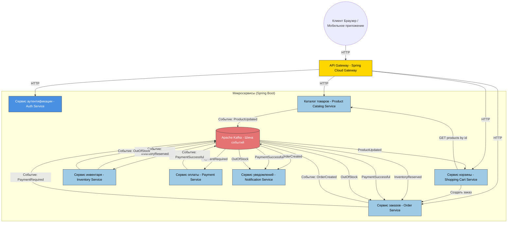

# otus-docker-hub
This is training repo for course.

Here is minimal-health-service on Spring Boot with gradle

Mermaid diagramm:


    class ProductCatalogService,ShoppingCartService,OrderService,InventoryService,PaymentService,NotificationService service
    class API_Gateway gateway
    class Auth_Service auth
    class Kafka message

# OTUS Docker & Kubernetes Homework

Минимальное Spring Boot приложение, развернутое в Kubernetes с помощью Ingress-NGINX.  
Отвечает на `GET /health` с `{"status": "OK"}`.

## 🚀 Запуск приложения

### 1. Установи Ingress-NGINX через Helm

> ⚠️ Используй `helm`, а не встроенный в minikube Ingress.

```powershell
Все команды выполнять в корне проекта!

kubectl create namespace m
helm repo add ingress-nginx https://kubernetes.github.io/ingress-nginx/
helm repo update
helm install nginx ingress-nginx/ingress-nginx -n m -f nginx-ingress.yaml

minikube start --driver=docker

kubectl apply -f k8s/
Проверяем что всё поднялось и проставился ADDRESS у nginx-ingress
get ingress -n m
kubectl get pods -n m
get services -n m

В etc/hosts проставляем 127.0.0.1 arch.homework

Запускаем тунель в отдельной командной строке
minikube tunnel

Команда для проверки: curl -v http://arch.homework/health