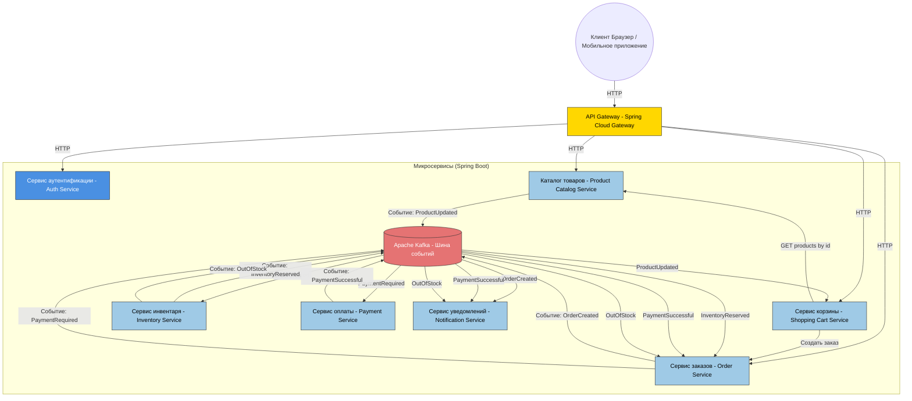
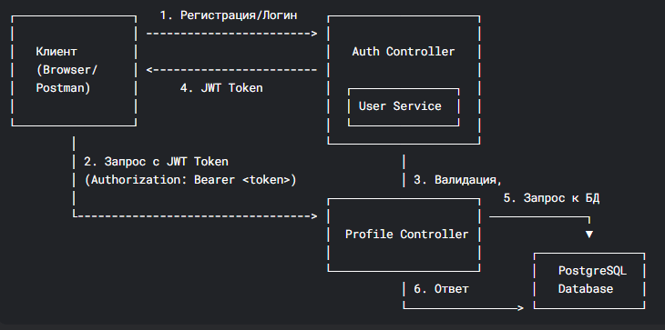

# otus-docker-hub
This is training repo for course.

Here is minimal-health-service on Spring Boot with gradle

Mermaid diagramm:


```mermaid
graph TD
    Client((Клиент Браузер / Мобильное приложение)) --> |HTTP| API_Gateway[API Gateway - Spring Cloud Gateway]

    API_Gateway --> |HTTP| Auth_Service
    API_Gateway --> |HTTP| ProductCatalogService
    API_Gateway --> |HTTP| ShoppingCartService
    API_Gateway --> |HTTP| OrderService

    subgraph "Микросервисы (Spring Boot)"
        Auth_Service[Сервис аутентификации - Auth Service]
        ProductCatalogService[Каталог товаров - Product Catalog Service]
        ShoppingCartService[Сервис корзины - Shopping Cart Service]
        OrderService[Сервис заказов - Order Service]
        InventoryService[Сервис инвентаря - Inventory Service]
        PaymentService[Сервис оплаты - Payment Service]
        NotificationService[Сервис уведомлений - Notification Service]
        Kafka[(Apache Kafka - Шина событий)]
    end

    %% Связь: Корзина → Каталог (валидация при добавлении)
    ShoppingCartService --> |GET products by id| ProductCatalogService
    %% Или альтернативно (через события):
    ProductCatalogService --> |Событие: ProductUpdated| Kafka
    Kafka --> |ProductUpdated| ShoppingCartService

    %% Основной поток заказа
    ShoppingCartService --> |Создать заказ| OrderService

    OrderService --> |Событие: OrderCreated| Kafka
    Kafka --> |OrderCreated| InventoryService
    Kafka --> |OrderCreated| NotificationService

    InventoryService --> |Событие: InventoryReserved| Kafka
    Kafka --> |InventoryReserved| OrderService

    OrderService --> |Событие: PaymentRequired| Kafka
    Kafka --> |PaymentRequired| PaymentService

    PaymentService --> |Событие: PaymentSuccessful| Kafka
    Kafka --> |PaymentSuccessful| OrderService
    Kafka --> |PaymentSuccessful| NotificationService

    InventoryService --> |Событие: OutOfStock| Kafka
    Kafka --> |OutOfStock| OrderService
    Kafka --> |OutOfStock| NotificationService

    style Auth_Service fill:#4A90E2,stroke:#333,color:white
    style ProductCatalogService fill:#9FCAE6,stroke:#333,color:black
    style ShoppingCartService fill:#9FCAE6,stroke:#333,color:black
    style OrderService fill:#9FCAE6,stroke:#333,color:black
    style InventoryService fill:#9FCAE6,stroke:#333,color:black
    style PaymentService fill:#9FCAE6,stroke:#333,color:black
    style NotificationService fill:#9FCAE6,stroke:#333,color:black
    style API_Gateway fill:#FFD700,stroke:#333,color:black
    style Kafka fill:#E57373,stroke:#333,color:white

    classDef service fill:#9FCAE6,stroke:#2171B5,stroke-width:2px,color:black;
    classDef gateway fill:#FFD700,stroke:#333,stroke-width:2px,color:black;
    classDef message fill:#E57373,stroke:#333,stroke-width:2px,color:white;
```
    class ProductCatalogService,ShoppingCartService,OrderService,InventoryService,PaymentService,NotificationService service
    class API_Gateway gateway
    class Auth_Service auth
    class Kafka message

# OTUS #2 Docker & Kubernetes Homework

Минимальное Spring Boot приложение, развернутое в Kubernetes с помощью Ingress-NGINX.  
Отвечает на `GET /health` с `{"status": "OK"}`.

## 🚀 Запуск приложения

### 1. Установи Ingress-NGINX через Helm

> ⚠️ Используй `helm`, а не встроенный в minikube Ingress.

```powershell
Все команды выполнять в корне проекта!
minikube start --driver=docker

kubectl create namespace m
helm repo add ingress-nginx https://kubernetes.github.io/ingress-nginx/
helm repo update
helm install nginx ingress-nginx/ingress-nginx -n m -f nginx-ingress.yaml

kubectl apply -f k8s/
Проверяем что всё поднялось и проставился ADDRESS у nginx-ingress
get ingress -n m
kubectl get pods -n m
get services -n m

В etc/hosts проставляем 127.0.0.1 arch.homework

Запускаем тунель в отдельной командной строке
minikube tunnel

Команда для проверки: curl -v http://arch.homework/health
```
# OTUS #3 Работа с Helm

Простейшее CRUD Spring Boot приложение, развернутое в Kubernetes с помощью Ingress-NGINX.
В корне проекта постман коллекция CRUD_test.postman_collection.json

## 🚀 Запуск приложения

```powershell
Все команды выполнять в корне проекта!
minikube start --driver=docker

kubectl create namespace m
helm repo add ingress-nginx https://kubernetes.github.io/ingress-nginx/
helm repo add bitnami https://raw.githubusercontent.com/bitnami/charts/archive-full-index/bitnami
helm repo update
helm install nginx ingress-nginx/ingress-nginx -n m -f nginx-ingress.yaml
kubectl apply -f k8s/
Проверяем что всё поднялось и проставился ADDRESS у nginx-ingress
kubectl get ingresses,pods,services -n m

Запускаем тунель в отдельной командной строке
minikube tunnel

Команды для базовой проверки: 
curl -v http://arch.homework/health
curl -v http://arch.homework/api/v1/user/1
Логи сервисов
kubectl logs -n m deploy/otus-app -f
```

```powershell
Команды для запуска helm чарта

minikube start --driver=docker

helm dependency update otus-app/
helm repo add ingress-nginx https://kubernetes.github.io/ingress-nginx/
helm repo update
helm upgrade --install nginx ingress-nginx/ingress-nginx -n ingress-nginx --create-namespace -f nginx-ingress.yaml
#Ждём пока поднимется nginx controller
Start-Sleep -Seconds 50
#Проверяем что всё поднялось и проставился ADDRESS у nginx-ingress
kubectl get ingresses,pods,services -n ingress-nginx
kubectl get ingresses,pods,services -n m

# Устанавливаем приложение
helm upgrade --install otus-app otus-app/ -n m --create-namespace --wait
kubectl get ingresses,pods,services -n m

#Запускаем тунель в отдельной командной строке
minikube tunnel

#Доп команды для отладки:
kubectl get namespace m -o yaml
kubectl get deployment m -o yaml
kubectl get ingresses,pods,services -n m
kubectl logs -n m otus-app-65b5f4d85b-74lgv -f
kubectl logs -n m otus-app-postgresql-0 -f
kubectl logs -n ingress-nginx nginx-ingress-nginx-controller-pj5lb -f
kubectl get secret -n m db-secret -o yaml
helm uninstall otus-app -n m
```
# OTUS #4 Grafana/Prometheus

## 🚀 Запуск приложения

```powershell
# В этом задании использовать 0.0.9 версию
# 1. Запускаем Minikube
minikube start --driver=docker

# 2. Создаем неймспейсы
kubectl create namespace ingress-nginx
kubectl create namespace m
kubectl create namespace monitoring

# 3. Обновляем репозитории Helm
helm repo update

# 4. Устанавливаем NGINX Ingress Controller
helm upgrade --install nginx ingress-nginx/ingress-nginx `
  -n ingress-nginx `
  -f nginx-ingress.yaml `
  --wait

# 5. Ждем полного запуска NGINX
Start-Sleep -Seconds 60

# 6. Отключаем webhook валидацию
kubectl delete validatingwebhookconfiguration nginx-ingress-nginx-admission --ignore-not-found

# 7. Создаем сервис для метрик NGINX
kubectl apply -f nginx-metrics-service.yaml

# 8. Устанавливаем Prometheus Stack
helm upgrade --install prometheus-stack prometheus-community/kube-prometheus-stack `
  -n monitoring `
  --set grafana.adminPassword=admin `
  --set grafana.ingress.enabled=true `
  --set grafana.ingress.hosts[0]=grafana.arch.homework `
  --set grafana.ingress.ingressClassName=nginx `
  --wait

# 9. Создаем ServiceMonitor для NGINX
kubectl apply -f nginx-service-monitor.yaml

# 10. Добавляем дашборд в Grafana
kubectl apply -f grafana-dashboard-otus.yaml

# 11. Обновляем зависимости приложения
helm dependency update otus-app/

# 12. Устанавливаем приложение
helm upgrade --install otus-app otus-app/ `
  -n m `
  --wait

minikube tunnel

# 13. Добавляем записи в hosts файл
$hostsContent = @"
127.0.0.1 arch.homework
127.0.0.1 grafana.arch.homework
127.0.0.1 alertmanager.arch.homework
127.0.0.1 prometheus.arch.homework
"@
Add-Content -Path "C:\Windows\System32\drivers\etc\hosts" -Value $hostsContent -Force

# 14. Запускаем Minikube tunnel в ОТДЕЛЬНОМ окне
Start-Process -FilePath "minikube" -ArgumentList "tunnel" -WindowStyle Normal

# 15. Перезапускаем Grafana для применения дашборда
kubectl rollout restart deployment prometheus-stack-grafana -n monitoring

# 16. Ждем перезапуска Grafana
Start-Sleep -Seconds 30

# 17. Проверяем все компоненты
kubectl get pods -A
kubectl get svc -A
kubectl get ingress -A
kubectl get servicemonitors -A

# 18. Получаем пароль Grafana
$grafanaPassword = kubectl get secret -n monitoring prometheus-stack-grafana -o jsonpath="{.data.admin-password}" | base64 --decode
echo "Grafana password: $grafanaPassword"

# 19. Проверяем приложение
curl -v http://arch.homework/health
curl -v http://arch.homework/api/v1/user/1

echo "Установка завершена!"
echo "Приложение: http://arch.homework"
echo "Grafana: http://grafana.arch.homework (admin/$grafanaPassword)"
```
# OTUS #5 API Gateway


## 🚀 Запуск приложения
```powershell
## Команды для сборки

# Сборка проекта
./gradlew clean build -x test

# Собираем Docker образ
docker build -t jvmisalive/otus-docker-hub:0.0.15 .

# Пушим в Docker Hub
docker push jvmisalive/otus-docker-hub:0.0.15

# Пулим из Docker Hub
docker pull jvmisalive/otus-docker-hub:0.0.15

## Команды для запуска

# 1. Запускаем Minikube
minikube start --driver=docker

# 2. Создаем неймспейсы
kubectl create namespace ingress-nginx
kubectl create namespace m
kubectl create namespace monitoring

# 3. Обновляем репозитории Helm
helm repo update

# 4. Устанавливаем NGINX Ingress Controller
helm upgrade --install nginx ingress-nginx/ingress-nginx `
  -n ingress-nginx `
  -f nginx-ingress.yaml `
  --wait

# 5. Ждем полного запуска NGINX
Start-Sleep -Seconds 60

# 6. Отключаем webhook валидацию
kubectl delete validatingwebhookconfiguration nginx-ingress-nginx-admission --ignore-not-found

# 7. Создаем сервис для метрик NGINX
kubectl apply -f nginx-metrics-service.yaml

# 8. Устанавливаем Prometheus Stack
helm upgrade --install prometheus-stack prometheus-community/kube-prometheus-stack `
  -n monitoring `
  --set grafana.adminPassword=admin `
  --set grafana.ingress.enabled=true `
  --set grafana.ingress.hosts[0]=grafana.arch.homework `
  --set grafana.ingress.ingressClassName=nginx `
  --wait

# 9. Создаем ServiceMonitor для NGINX
kubectl apply -f nginx-service-monitor.yaml

# 10. Добавляем дашборд в Grafana
kubectl apply -f grafana-dashboard-otus.yaml

# 11. Обновляем зависимости приложения
helm dependency update otus-app/

# 12. Устанавливаем приложение
helm upgrade --install otus-app otus-app/ `
  -n m `
  --wait

# Запускаем туннель в отдельном окне
minikube tunnel

# Просмотр логов в отдельном окне
kubectl logs -n m deploy/otus-app -f

# Запускаем постман коллекцию
newman run auth-tests.postman_collection.json `
--reporters cli `
--reporter-cli-show-request-body `
--reporter-cli-show-response-body
```